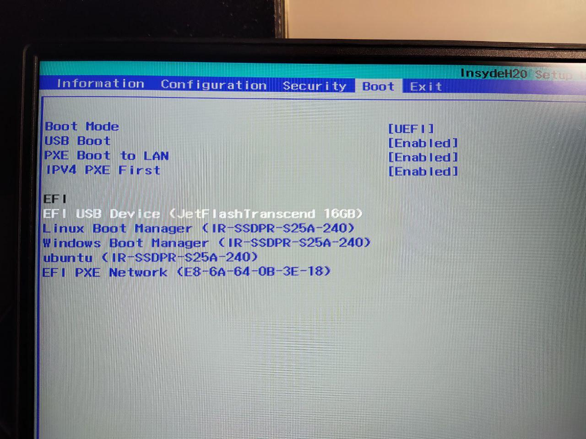
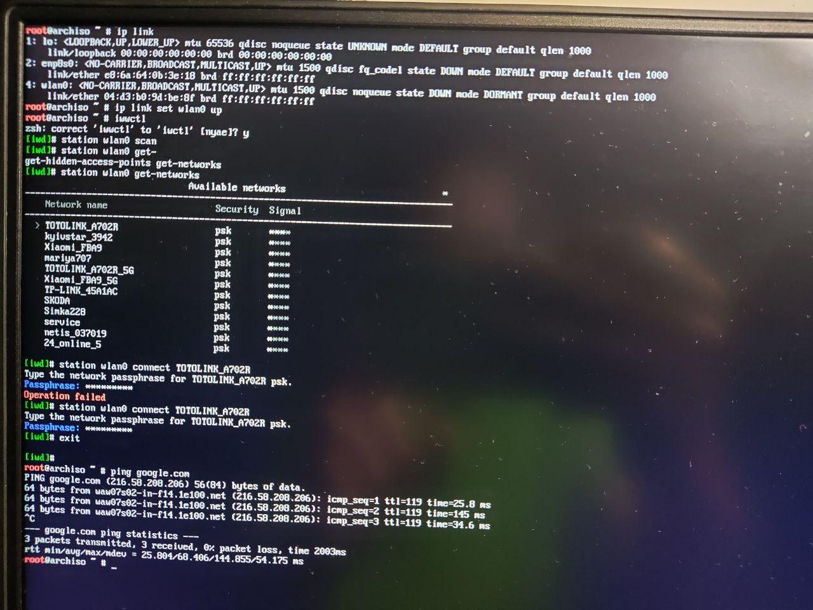

+++
title = "Arch installation manual"
date = 2019-11-27
[taxonomies]
tags = ["Arch Linux", "Installation", "Manual"]
+++
# Installing Arch

*The basis for this tutorial is [this one](https://sollus-soft.blogspot.com/2017/01/arch-linux-windows-10-uefi-systemd-boot.html)*

Always keep tabs on this [extended official tutorial](https://wiki.archlinux.org/index.php/installation_guide).

## Preparing

### For Linux users: 

- First of all, install arch ISO on your USB stick. [Here](https://www.archlinux.org/download/) you can find an official image. 

- Check your USB name using fdisk program `fdisk -l`. Ypu are interested in `/dev/sdX` kind of disk.

- Use `dd` tool to make bootable drive

```
$ sudo dd if=/dev/sdX of=~/arch_image.iso
```

[skip windows manual](#main-part-of-installation)

### For Windows users:

First of all, install arch ISO on your USB stick. [Here](https://www.archlinux.org/download/) you can find an official image. 

I recomend using [RUFUS](https://rufus.ie/) for proper image installation. Choose everything as you see on this photo: 


**Important!** all files from USB-stick will be deleted

Now go to the BIOS (press F2 or F8 or smth else on you laptop during booting), and choose `UEFI mode` and change boot order (make your USB first prior). result should be something like that:



Save changes and exit

## Main part of installation
Firstly check if you're loaded in EFI mode: `efivar -l`. The output should be like this: 


On some computers Wifi won't work without turning the module on with this  command: `rfkill unblock all`

Now let's turn on Wifi. Firstly get name of your interface: `ip link` (it usually starts with 'w', i.e: 'wlan0') 
Then activate the interface: `ip link set interface_name up`.

First method: `iwctl` 
```
iwctl
station interface_name scan
station interface_name get-networks
station interface_name connect network_name
```

Example of turning on wifi:



Check if internet works with `ping google.com` (should appear messages with '64 bytes' at the beginning, press CTRL+C to finish check)

Time synchronization: `timedatectl set-ntp true`

Now let's look at your previous boot records: `efibootmgr` and delete previous linux or some other stuff: `efibootmgr -b X -B`, where 'X' is number of stuff's boot

Here is how it should look like


Now disk management: `cfdisk`. Here I delete everything from previous system and 
- choose  root directory (about 60GB, linux filesystem) 
- boot partition (1GB, EFI filesystem) (Actually it's better to install bootloader on the Windows EFI partition, if you want to see choise of system during loading). 
- Create (or do nothing if you already have) home directory (40+GB, linux filesystem). 
- Create swap partition (Your RAM size * 2, Linux swap)
Don't forget to "write" after making new partition. And don't delete Windows partitions if you want dual boot.

Here, how it looks on my laptop:

As you can see I have 64GB root (/dev/sda11), 33GB home (/dev/sda10) 20GB swap (/dev/sda5), and my boot is /dev/sda3. Remeber, that on your laptop/PC, there will be other partition numbers.

Now format partition and mount them. Root:
```
mkfs.ext4 /dev/sda{root number} -L "ARCH"
mount /dev/sda{root number} /mnt
```

Boot:
```
mkdir -p /mnt/boot
mkfs.fat -F32 /dev/sda{boot number}
mount /dev/sda{boot number} /mnt/boot
```

Or just mount Windows EFI partition, if you didn't create new one
```
mount /dev/sda{windows boot number} /mnt/boot
```

Swap:
```
mkswap /dev/sda{swap num}
swapon /dev/sda{swap num}
```

Home:
```
mkdir -p /mnt/home
mkfs.ext4 /dev/sda{home number} -L "home"
mount /dev/sda{home number} /mnt/home
```

Now let's update pacman: `pacman  -Syy`

Install base system and packet for future AUR using: `pacstrap /mnt base linux linux-firmware base-devel linux-headers`

Generate fstab: `genfstab -U /mnt >> /mnt/etc/fstab`
Check if it is generated: `nano /mnt/etc/fstab`

Example fstab(don't forget to change filesystem UUIDs (you can find them in 'cfdisk')): 
```
UUID=8d3f44f4-a017-4c76-9e66-dd5068dc5397	/         	ext4      	rw,relatime,discard	0 1

UUID=2f671175-0fe6-472a-a4b0-1da5345f03e1	/home     	ext4      	rw,relatime,discard	0 2

UUID=1892-CB1C      	/boot     	vfat      	rw,relatime,fmask=0022,dmask=0022,codepage=437,iocharset=iso8859-1,shortname=mixed,utf8,errors=remount-ro	0 2
```
!!**IMPORTANT**!! If you have SSD, than this is extremely important to automatically activate TRIM each time it's needed. This will save lifetime of your SSD. So please, add 'discard' option to mount points in fstab (as you can see in the example)

Now let's go in arch: `arch-chroot /mnt `

It is good idea to download an adequate text editor at the beggining: `pacman -S vim`

super short guide for vim: 
- i - go to 'insert' mode (you can type in this mode!)
- Esc - back to 'normal' mode
- :w - write to file (in normal mode)
- :q - quit from file (again, in normal mode) (you can combine: ':wq') 

Adjust locals: `vim /etc/locale.gen` and uncomment
```
en_US.UTF-8 UTF-8
ru_RU.UTF-8 UTF-8
uk_UA.UTF-8 UTF-8
```
Don't forget to save and actually generate the locales:
```
locale-gen
```

Adjust time zone and time: 
```
ln -sf /usr/share/zoneinfo/Europe/Kiev /etc/localtime
hwclock --systohc
```

Adjust the name of the computer: `vim /etc/hostname` and write there _"YOUR_HOSTNAME"_

Adjust hosts: `vim /etc/hosts` and write there -_"127.0.0.1 pavlik_giley.localdomain YOUR_USERNAME"-_ 
DONT FORGET TO SAVE EVERYTHING

Password for root: `passwd` 

Add new user: `useradd -G wheel -s /bin/bash -m YOUR_USERNAME`, and give him sudo permissions: `vim /etc/sudoers` 
and uncomment `%wheel ALL=(ALL) ALL`

user's password: `passwd YOUR_USERNAME`

Download some potentially useful stuff: `pacman -S  efibootmgr iw wpa_supplicant dialog netctl dhcpcd`.
And more: `pacman -S ntfs-3g mtools fuse2`

Install bootloader: `bootctl install`

Loader config: `vim /boot/loader/loader.conf`

Example loader: 
```
default arch
timeout 2
editor 0
```
(It will wait 2 seconds before running into default choice - arch, editor 0 means you can't change loader parameters during boot(this is for security))

Now it is vital to adjust kernel settings: 
```
pacman -S intel-ucode
vim /boot/loader/entries/arch.conf
```
Write here something like this (maybe you will need to change them in the future):
```
title Arch Linux
linux /vmlinuz-linux
initrd /intel-ucode.img
initrd /initramfs-linux.img
options root="LABEL=ARCH" rw
```
Now exit and umount all partition:
```
exit
umount -R /mnt
reboot
```

# GNOME installation

Install X: `sudo pacman -S xorg-server xorg-xinit xorg-apps mesa-libgl xterm`

Install graphic drivers:
```
sudo pacman -S xf86-video-intel
sudo pacman -S nvidia #if you have nvidia GPU
```

Now install GNOME itself:
```
sudo pacman -Syu
sudo pacman -S gnome
systemctl enable NetworkManager
systemctl enable gdm
```

Lenovo y530 (my laptop) can't render HDMI output with intel GPU, so if you want to use second monitor, read [here](https://wiki.archlinux.org/index.php/PRIME#PRIME_render_offload)
Also download prime-run (for running application with nvidia GPU(if you have nvidia): `sudo pacman -S prime-run`

# System customization and apps installation
First of all set normal wallpalers, change touchpad sensitivity and other settings in GNOME

Python: 
```
sudo pacman python-pip
sudo pacman ipython
```

Battery optimization:
```
sudo pacman -S tlp
sudo tlp start
sudo systemctl enable tlp.service
```

It's a good idea to create new mirrorlist file for Pacman, if you from Ukraine, you can use this: (replace it in /etc/pacman.d/mirrorlist)
```
## Ukraine
Server = http://archlinux.ip-connect.vn.ua/$repo/os/$arch
Server = https://archlinux.ip-connect.vn.ua/$repo/os/$arch
Server = http://mirror.mirohost.net/archlinux/$repo/os/$arch
Server = https://mirror.mirohost.net/archlinux/$repo/os/$arch
Server = http://mirrors.nix.org.ua/linux/archlinux/$repo/os/$arch
Server = https://mirrors.nix.org.ua/linux/archlinux/$repo/os/$arch
```
Or use automated tool `rankmirrors` for ranking mirrors:
```
rankmirrors -n 0 /etc/pacman.d/mirrorlist
```

Terminal: `sudo pacman -S terminology`

git: `sudo pacman -S git`

yay: `git clone https://aur.archlinux.org/yay.git; cd yay; makepkg -si`

zsh installation and customization with oh my zsh:
```
cd ~
sudo pacman -S zsh
sh -c "$(curl -fsSL https://raw.githubusercontent.com/ohmyzsh/ohmyzsh/master/tools/install.sh)"
git clone https://github.com/zsh-users/zsh-syntax-highlighting.git
echo "source ${(q-)PWD}/zsh-syntax-highlighting/zsh-syntax-highlighting.zsh" >> ${ZDOTDIR:-$HOME}/.zshrc
```
Browser + telegram: 
```
yay telegram-desktop
yay firefox
```
Don't forget to sign in gmail, youtube, CMS, etc.

CUSTOMIZATION
```
sps gnome-tweaks
```
Download all extension and setup tweask as you like

Install VScode: `yay visual-studio-code-insiders`

Cion `yay clion #chose just clion`. Don't forget to activate licension and type path to compilers and debugger

Pycharm `yay pycharm #choose community version` Don't forget to install material theme and set 18's font

STM32. Install eveything except eclipse from [this tutorial](https://gist.github.com/Myralllka/42385fdecacb7cc2a45ec9376b57a4b2)
After this download STM32CubeMX itself from [official site](https://www.st.com/en/development-tools/stm32cubemx.html)
Then unzip script, give permissions to run it (chmod +x scriptname.sh) and run it with sudo

Then if you will have problems with debuggger run those commands:
```
cd /usr/lib
sudo ln -s libncursesw.so.6.1 libncurses.so.5
sudo ln -s libncursesw.so.6.1 libtinfo.so.5
```
Follow [this tutorial](https://gist.github.com/Myralllka/42385fdecacb7cc2a45ec9376b57a4b2) to work with STM32 through CLion: 

List of other apps I use:
1. Slack
2. IntellijIDEA (don't forget to get jdk)
3. AndroidStudio (+sdk +ndk)
4. zoom
5. Microsoft Teams ('teams' package in local repository)
6. clion-gui
7. LibreOffice

Also it's quite useful to configurate your touchpad gestures with [this](https://github.com/bulletmark/libinput-gestures) application, if you're using xorg on gnome

Looks like that's it. Happy archlinux experience!

